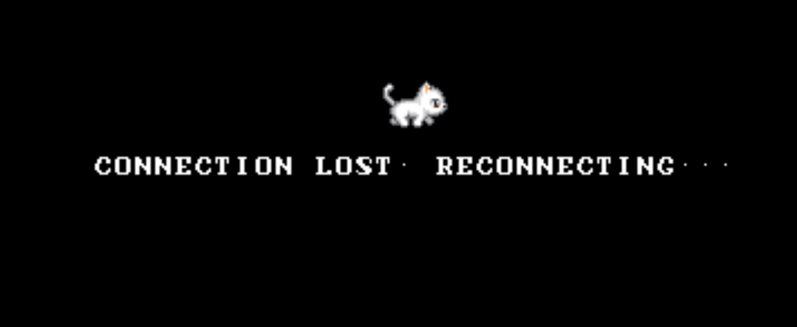
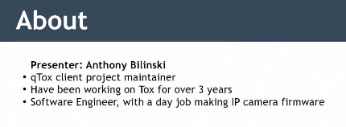
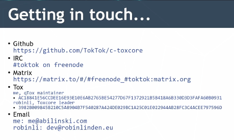
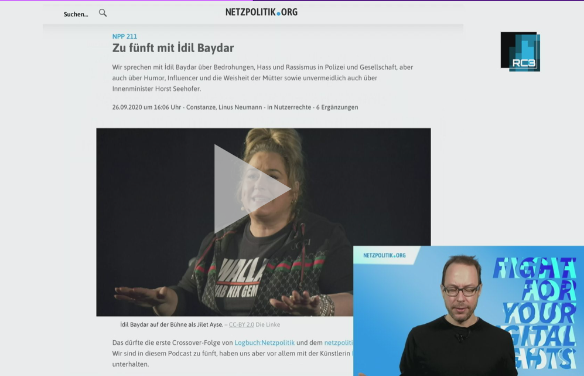
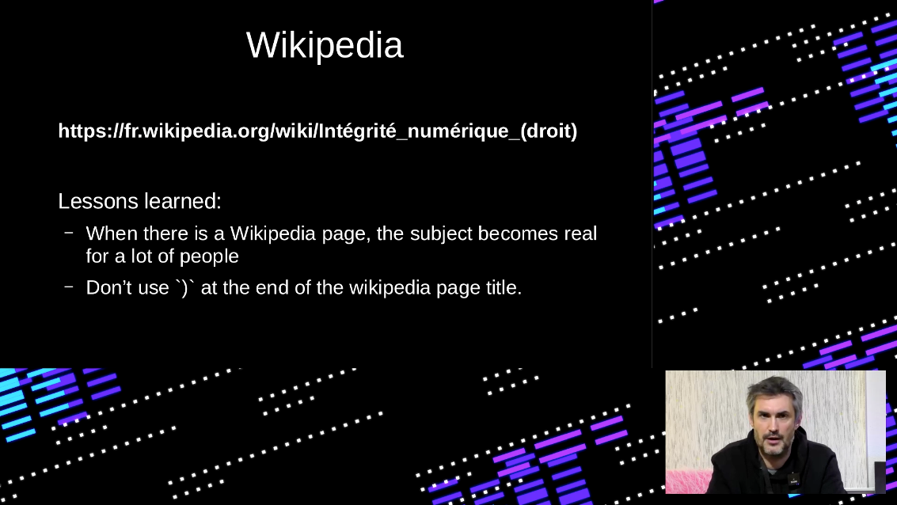
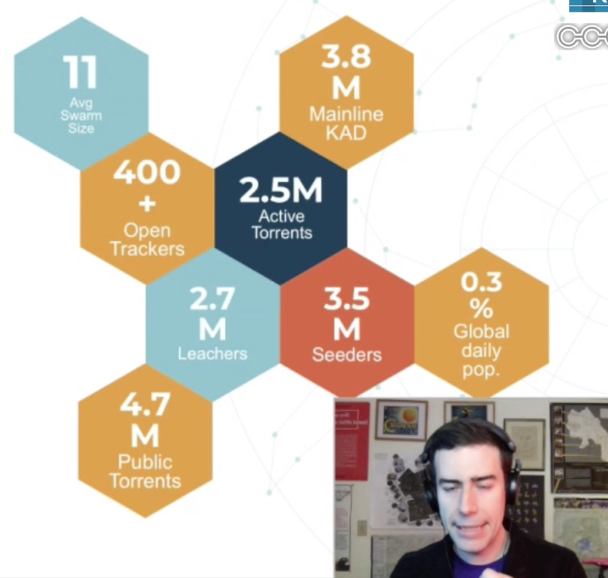
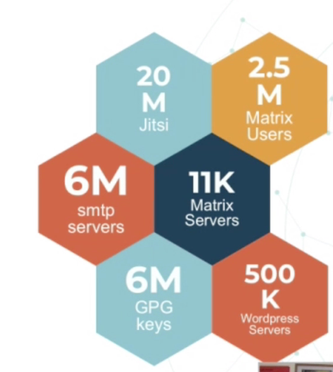
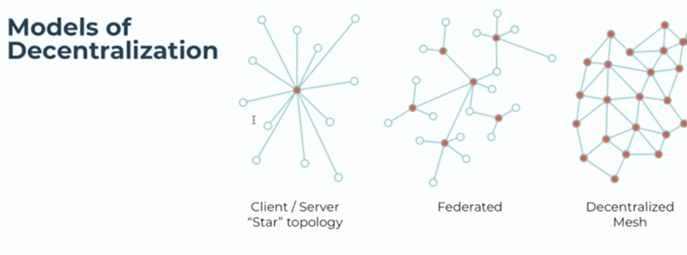
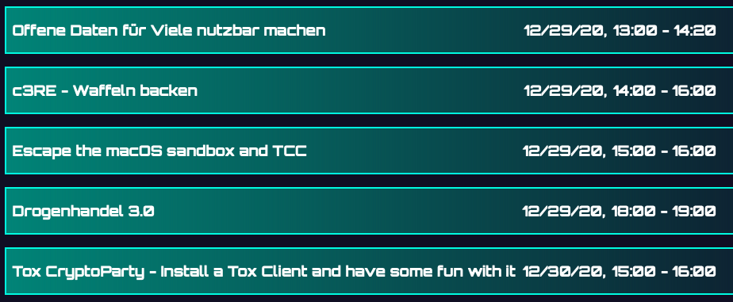

This year (Dec 2020) I had a ticket for the RC3. They were freely distributed, but ran out quickly. So I felt proud, and spent quite some time wtaching the CCC sessions.

All the talks are available [here](https://media.ccc.de/c/rc3). I watched (partly or entirely) some of them.

Besides the talks there was a *2D World* - that never worked for me 😢 (and my network link was rather good!):

### An Introduction to Tox

A new Messaging service. Better than email, Matrix and all the other messenger platforms. Advantages:

- No central servers, no way to disable any of the encryption features. 
- Features of tox: Instant messaging, Voice calls, Video calls, Screen sharing, File sharing, Groups.

It was interesting to learn, that there are MANY chat protocols out there. And many of them have similar goals: Keeping the data secure, and sometimes even the metadata. It seems to be a decision one has to make wether your protocol really hides the metadata (usually this is done by using Tor underneauth) or to provide low latency in order to also allow voice and video.

Questions that come to my mind:

- Does is really provide video calls, or does it simply launch other video calls (i.e. Jitsi) - just as matrix does?
- Are the voice and video calls also really encrypted? Because Cisco Webex does not encrypt it's video calls (only chats)

About the guy:

### Der netzpolitische Wetterbericht

Live angehört, von Markus Beckedahl (von [netzpolitik.org](https://netzpolitik.org))

Was ist letztes Jahr so passiert, welche Themen sind heiß?

- Regierungen wollen Schlüssel um verschlüsselte Kommunikation abzuhören.
- Staatstrojaner nutzen Sicherheitslücken - anstatt dass man diese schnell stopfen würde.
- SmartHome-Geräte wurden als Zeugen vor Gericht vorgeladen: Alexa hat erzählt, was ihr aufgetragen wurde
- Das BND-Gesetz wurde als verfassungswidrig klassifiziert - schönes Erlebnis 😀. Aber ein neues BND-Gesetz wurde flott durchgepeitscht...
- Der [Podcast mit Idil Baydar](https://podcasts.apple.com/lu/podcast/npp-211-zu-fünft-mit-i-dil-baydar/id1281525246?i=1000492613815) - etwas derb aber recht interessant, in Summe empfehlenswert.

Habe dann abgebrochen, war recht dröge...

### Digital integrity of the human person, a new fundamental right 2020 update

The guy (Alexis Roussel, Swiss) explains how the Human Rights should / could be extended to the digital space. 

Some interesting points he made:

- There is a bug in the GDPR (Article 2): The government can access all data in case of danger. Too vague as a description and breaks the basic idea of the GDPR.
- In Switzerland some cantons are updating their Constitution to extend it to the digital space.

Only dropped in for 15 minutes, didn't listen to the end...

### Building Blocks of Decentralization

The guy talking is [Will Scott](https://www.linkedin.com/in/willrscott/). He seems to be a IPFS guy.

- Currently the largest decentralized system is BitTorrent

- Another huge distributed system is [Mastodon](https://github.com/tootsuite/mastodon) "The Fediverse". *What the hack is this?*

- IPFS passed 2M users
- SSB (Secure Scuttlebutt) 100K users
- Bitcoin: 1M active accounts

- Centralized: Facebook. Federated: matrix. Decentralized mesh?

The actual building blocks of decentralization:

- DHT: Distributed Hash Tables
- BFT (Byzantine Fault Tolerance) Consensus. There seems to be an explanation [here](https://academy.binance.com/en/articles/byzantine-fault-tolerance-explained). 
- Consensus can be achieved by *Proof of Work* or by *Proof of Stake*.

He then discussed limitations of those Building Blocks: Volume, number of entities, how many hops --> latency, bandwidth (esp. upload compared to download), 

### Weitere Talks...

...die ich gerne anhören würde:

- [Verwaltung von Projekten mit Gitea](https://media.ccc.de/v/rc3-channels-2020-70-verwaltung-von-projekten-mit-gitea): Nach dem Verkauf von Github an Microsoft werden sich viele die Frage gestellt haben, ob es nicht Alternativen gibt, über die man selbst die volle Kontrolle hat. Ich verwende seit zwei Jahren Go Anwendung Gitea sowohl für berufliche Projekte und Open Source. Gitea hat den Vorteil dass die Hürden für Installation, Wartung und Bedienung übersichtlich und schnell zu meistern sind.
Bemerkung: ich habe den Link am 28.12.20 probiert, da schien er falsch zu seine, es wurde über ganz andere Themen gesprochen (auch nteressant: Internationaly Netzpolitik)
- [Digitales Klassenzimmer](https://media.ccc.de/v/rc3-11591-digitales_klassenzimmer): In diesem Workshop können Lehrerinnen und Lehrer, Schüler.innen und andere Interessierte in Freie Schulsoftware reinschnuppern. BigBlueButton? Moodle? Nextcloud? Das sind die digitalen Klassenzimmer der Zukunft.
- [rC3 Eröffnung](https://media.ccc.de/v/rc3-11583-rc3_eroffnung)

Und das war mein Fahrplan für Day 3 (Di, 29. Dez):

